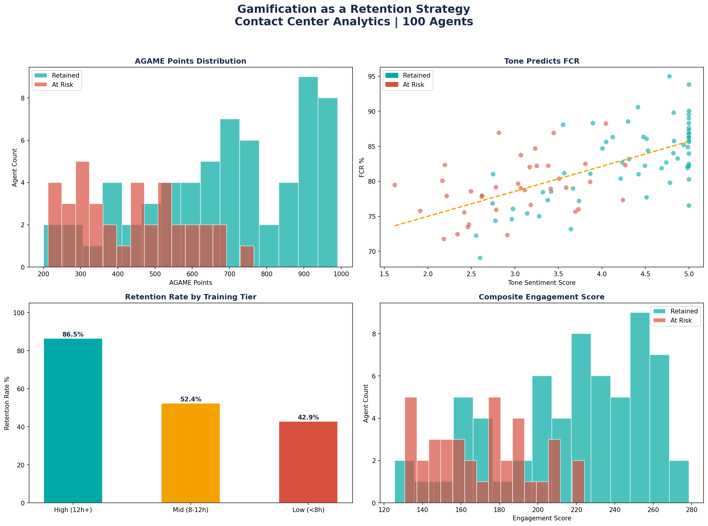

# Contact Center Retention Analysis
## Gamification as a Retention Strategy | Contact Center Analytics


---

## Executive Headline
> **63 out of 100 agents were retained. Agents with high training hours 
> retain at 86.5% vs 42.9% for low-training agents. Tone Sentiment score 
> (4.30 retained vs 3.00 at-risk) is the #1 leading indicator of attrition risk.**

---

## The Data Story

| Metric | Retained Agents | At-Risk Agents |
|---|---|---|
| Total Agents | 63 | 37 |
| Avg AGAME Points | 689 | 430 |
| Avg Tone Sentiment | 4.30 / 5.0 | 3.00 / 5.0 |
| Avg FCR Rate | ~84% | ~76% |
| Avg Training Hours | ~12.8h | ~7.9h |
| Retention Rate (High Training 12h+) | **86.5%** | — |
| Retention Rate (Mid Training 8-12h) | **52.4%** | — |
| Retention Rate (Low Training <8h) | — | **42.9%** |

---

## Visual Results


---

## Project Structure
```
data/        ← Mock dataset (100 contact center agents)
sql/         ← 5 SQL queries: segmentation, JOINs, risk scoring
python/      ← Analysis + visualization scripts
outputs/     ← Generated charts (PNG)
```

---

## Key Findings

**1. AGAME Gamification Score is a clear retention signal**
Retained agents averaged 689 AGAME points vs 430 for at-risk agents —
a 60% difference driven purely by gamification engagement.

**2. Training Hours is the strongest retention driver**
- High training (12h+): 86.5% retention rate
- Mid training (8-12h): 52.4% retention rate
- Low training (<8h): 42.9% retention rate

**3. Tone predicts Talent**
Retained agents score 4.30/5.0 on Tone Sentiment vs 3.00/5.0 
for at-risk agents — a 43% gap that appears before attrition occurs.

**4. Composite Engagement Score works as an early warning system**
Combining AGAME Points + Training Hours + FCR + Tone Sentiment
creates a reliable signal to identify at-risk agents proactively.

---

## How to Run
```bash
git clone https://github.com/smithunmandikal/Contact-Center-Retention-Analysis
cd Contact-Center-Retention-Analysis
pip install pandas matplotlib seaborn scikit-learn numpy
python python/analysis.py
python python/charts.py
```

---

## SQL Queries Included
1. Preview and explore the dataset
2. Average metrics by retention group
3. JOIN — Training Tiers vs FCR performance
4. Tone Sentiment buckets vs Retention Rate
5. Composite Engagement Score — Top 10 at-risk agents

---

## Tools Used
- **Python** — pandas, matplotlib, seaborn, scikit-learn
- **SQL** — SQLite via DB Browser for SQLite
- **GitHub** — version control and public portfolio

---

## Author
**Shwetha Mithun Mandikal** | Contact Center Analytics
[LinkedIn](https://www.linkedin.com/in/shwethamm) |
[GitHub](https://github.com/smithunmandikal)

---
*This project uses mock data for portfolio demonstration purposes.*
